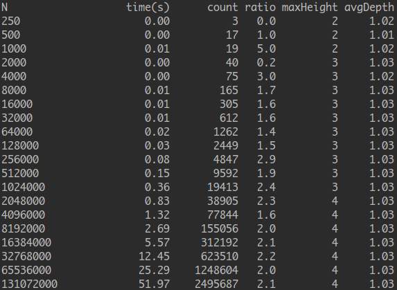
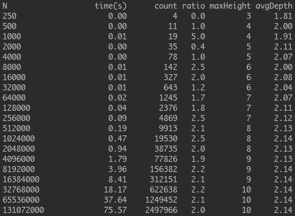
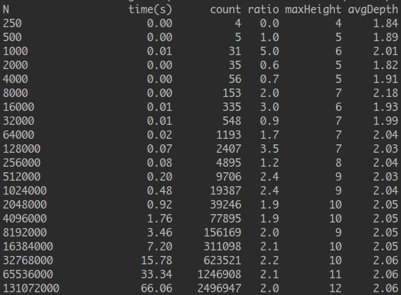

# 倍率实验结果

数据表 1：

| 算法                      | 时间 (N=128000,M=2N) | 时间 (N=128000,M=10N) | 比率 |
| ------------------------ | -------------------- | -------------------- | --- |
| QuickFind                | 13.5 | 13.5 | 4 |
| QuickUnion               | 38   | 310  | 5 |
| QuickUnion (优化 find 版) | 31.5 | 310  | 5 |
| MyWeightedQuickUnion     | 0.05 | 0.14 | 2 |

结论：
- 对于 QuickFind，证实了当 M/N 相对于 N 较小时，运行所需的时间与 M 关系不大，QuickFind 的增长数量级为 N^2
- 对于 QuickUnion，虽然使用了更高效的 union 实现，但 find 的实现比较低效，算法实际的整体效果还不如 QuickFind
- (?) 对于 QuickUnion (优化 find 版)，优化 find 对数组的访问次数，并没有提高效率，原因未知
- 加权 QuickUnion 将算法各个操作的成本降低到了 < log(N) 的级别

数据表 2：

| 算法                             | 时间 (N=16384000,M=2N) | 比率 |
| ------------------------------- | ---------------------- | --- |
| MyWeightedQuickUnion            | 8.41 | 2 |
| WeightedQuickUnion              | 7.20 | 2 |
| WeightedQuickUnion (使用路径压缩) | 6.09 | 2 |

# 总结

- QuickFind 的结构最简单
- QuickUnion 解决了 QuickFind 只能暴力 union 的低效做法
- WeightedQuickUnion 解决了 QuickUnion 盲目 union 的问题
- 路径压缩 使相同的迭代查找过程只进行一次，从而减少了不必要的重复过程。
  从另一个角度看，是在动态优化网络结构，大大降低了平均深度

# 个人探究

关于使用树的高度还是大小作为权重判断的依据：
- 使用高度作为依据时，严格将高度较小的树链接到高度较大的树上，可以保证网络中所有树的[最大高度]最小，即所有树的高度尽可能地小
- 使用大小作为依据时，将节点较少的树链接到节点较多的树上，但节点多并不代表高度就一定高，会出现小树的高度大于大树的情况

对于[大小为 4 高度为 2 的树 p]和[大小为 10 高度为 1 的树 q]:
- 当树 q 被链接到树 p 时，p 的高度没有增加，最大高度仍为 2，但有 10 个节点的深度加 1
- 当树 p 被连接到树 q 时，q 的高度由 1 变为 3，整个网络的最大高度为变为了 3，但只有 4 个节点的深度增加了 1 层

因此使用树的大小作为权重依据，考虑的是平均深度最小。而使用树的高度作为依据，考虑的则是最大深度最小。  
从效率上来说，使用大小作为更高效一些。  
从下面两张图片也能看出：使用树的大小作为依据时，虽然最大高度稍大，但平均深度更小，算法的速度更快

| 使用树的高度 | 使用树的大小（未使用路径压缩） |
| ---------- | ------------------------- |
|  |  |